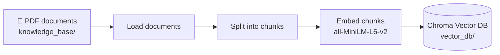
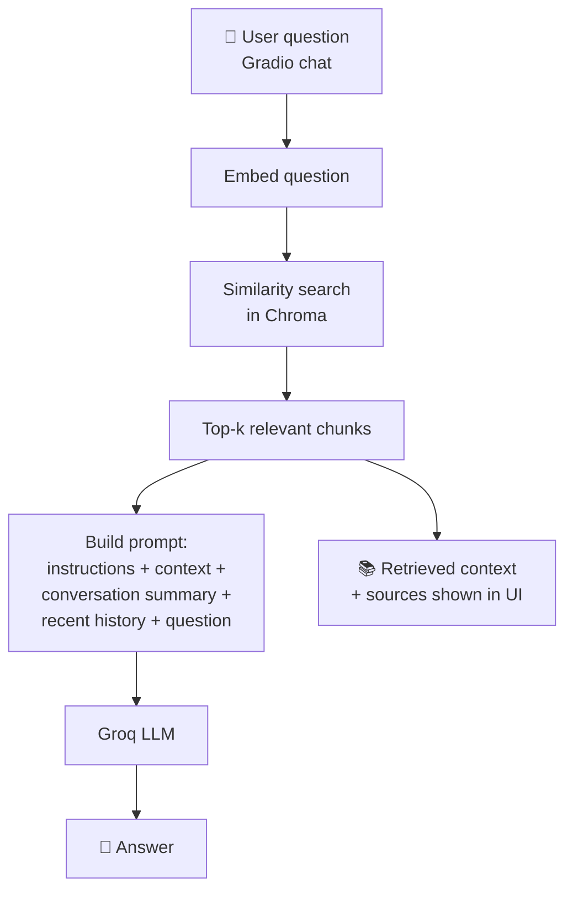

# ✈️ CloudWay RAG — Airline Knowledge Assistant

A Retrieval-Augmented Generation (RAG) chatbot that answers questions about **CloudWay 24**, a fictional airline, using a knowledge base of 40+ PDF documents. Answers are grounded in the retrieved documents, and the sources used are shown next to every response.

---

## 📌 Features

- **Grounded answers**: responses are generated from retrieved airline documents rather than the LLM's memory alone
- **40+ PDF knowledge base**: flights, baggage, policies, passenger assistance and more
- **Semantic search**: Hugging Face `all-MiniLM-L6-v2` embeddings with a Chroma vector database
- **Fast inference**: Groq-hosted LLM
- **Conversation memory**: older messages are summarised automatically so follow-up questions keep their context
- **Transparent UI**: a Gradio app showing the chat on one side and the retrieved context and sources on the other

---

## 🧠 How the RAG Pipeline Works

### Phase 1: Ingestion (offline)



1. **Load**: PDFs are read from `knowledge_base/`.
2. **Chunk**: documents are split into smaller overlapping pieces for precise retrieval.
3. **Embed**: each chunk is converted into a vector with `all-MiniLM-L6-v2`.
4. **Store**: vectors and metadata (such as `source`) are saved in Chroma.

### Phase 2: Question answering (online)



1. The user's question is embedded with the same model used during ingestion.
2. Chroma returns the most semantically similar chunks.
3. A prompt is built from the retrieved context, the conversation summary, the recent chat history and the question.
4. The Groq LLM generates the answer.
5. The UI displays the answer along with the retrieved chunks and their source files.

### Phase 3: Conversation memory

- When the chat grows beyond **10 messages**, older messages are condensed into a running summary.
- Only the **last 4 messages** are kept verbatim.
- The summary is passed into every later query, which keeps the prompt short while preserving context.

---

## 🛠️ Tech Stack

| Layer | Technology |
|---|---|
| Orchestration | LangChain |
| Embeddings | Hugging Face `all-MiniLM-L6-v2` |
| Vector database | Chroma |
| LLM | Groq (`<MODEL_NAME>`) |
| UI | Gradio |
| Language | Python 3.10+ |

---

## 📁 Project Structure

```
CloudWay-RAG/
├── app.py                 # Gradio UI and chat loop
├── implementation/
│   ├── ingest.py          # Loads PDFs, chunks, embeds, builds the vector DB
│   └── answer.py          # Retrieval, prompt building, LLM call, summarisation
├── knowledge_base/        # 40+ CloudWay 24 PDF documents
├── vector_db/             # Persisted Chroma database
├── requirements.txt
└── README.md
```

---

## 🚀 Getting Started

### 1. Clone the repository

```bash
git clone https://github.com/Nethra910/CloudWay-RAG.git
cd CloudWay-RAG
```

### 2. Create a virtual environment

```bash
python -m venv venv
source venv/bin/activate        # macOS / Linux
venv\Scripts\activate           # Windows
```

### 3. Install dependencies

```bash
pip install -r requirements.txt
```

### 4. Configure environment variables

Create a `.env` file in the project root:

```env
GROQ_API_KEY=your_groq_api_key_here
```

Get a free key from the [Groq Console](https://console.groq.com/).

### 5. Build the vector database

```bash
python implementation/ingest.py
```

### 6. Launch the assistant

```bash
python app.py
```

The Gradio app opens in your browser.

---

## 💬 Example Questions

- *What is the baggage allowance for economy passengers?*
- *What is CloudWay's policy for cancelled or delayed flights?*
- *What assistance is available for passengers with reduced mobility?*
- *Can I travel with a pet?*

---

## ⚙️ Configuration

| Setting | Value |
|---|---|
| Embedding model | `all-MiniLM-L6-v2` |
| Chunk size / overlap | `<CHUNK_SIZE>` / `<CHUNK_OVERLAP>` |
| Retrieved chunks (top-k) | `<K>` |
| LLM | `<MODEL_NAME>` on Groq |
| Summarise after | 10 messages (keeps the last 4) |

---

## 🔮 Future Improvements

- Hybrid search (keyword + semantic) and reranking
- Query rewriting for follow-up questions
- Source citations inside the answer text
- Evaluation with RAGAS or a test question set
- Deployment on Hugging Face Spaces or Docker

---

## 📝 Notes

- CloudWay 24 is a fictional airline created for learning and demonstration.
- Answers are limited to what the knowledge base contains.

---

## 🤝 Contributing

Contributions are welcome. Fork the repo, create a feature branch and open a pull request.

## 👤 Author

**Nethra** — [GitHub](https://github.com/Nethra910)
