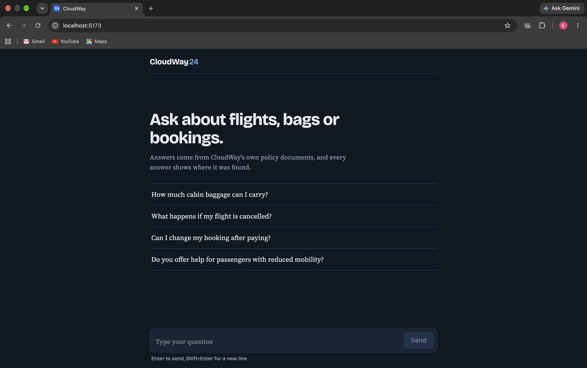
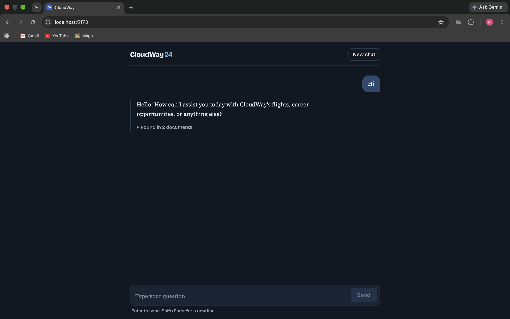
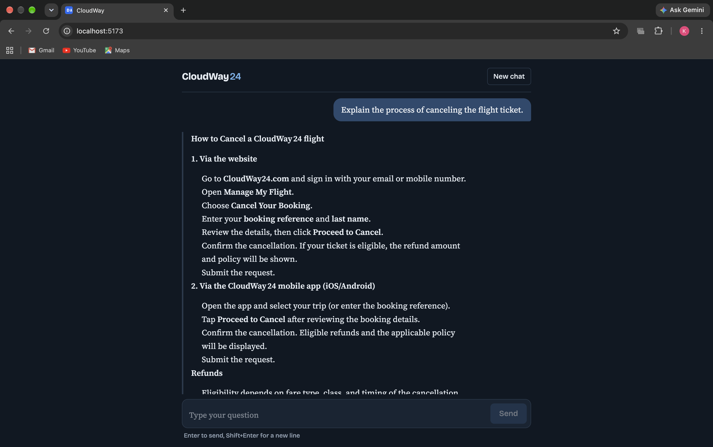
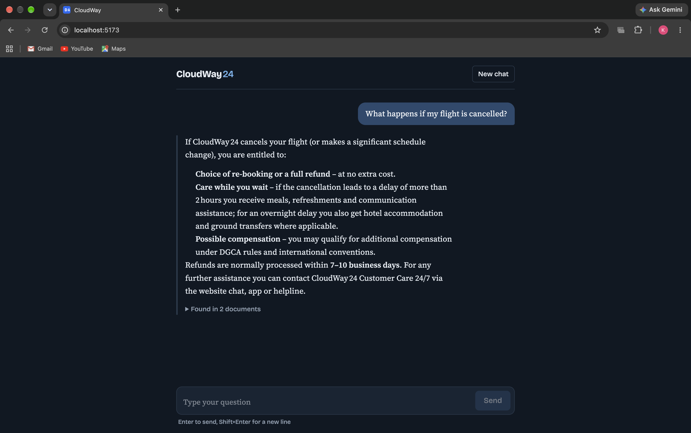
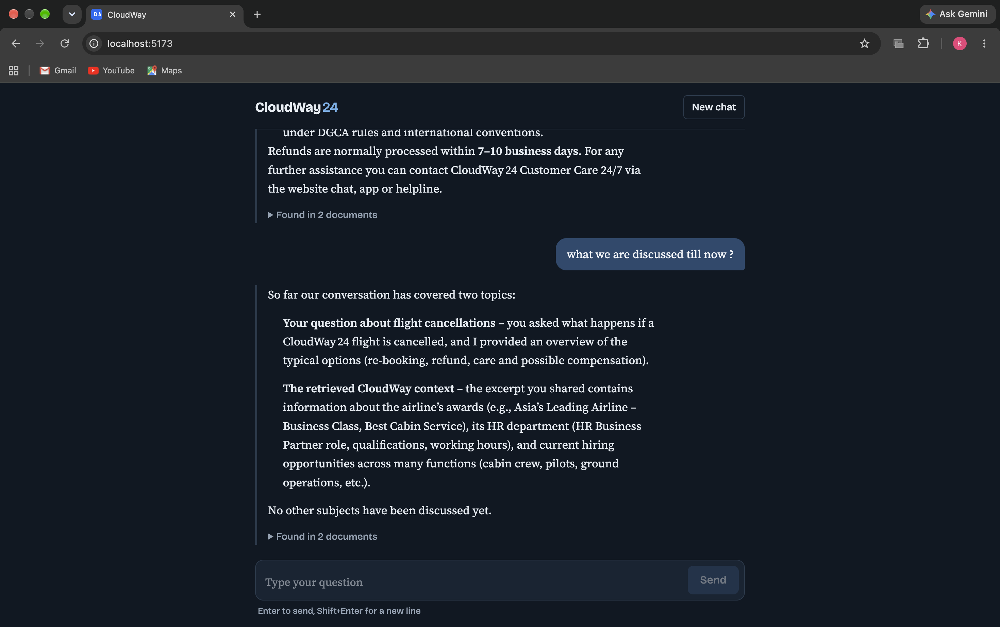
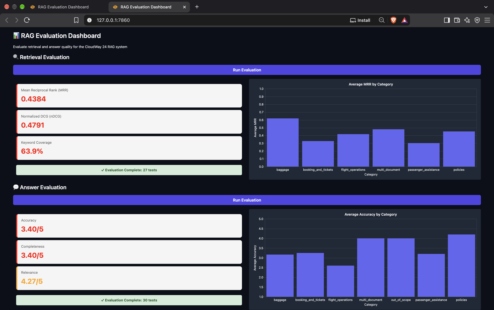
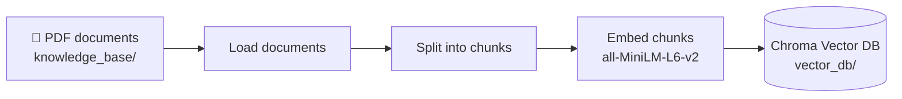
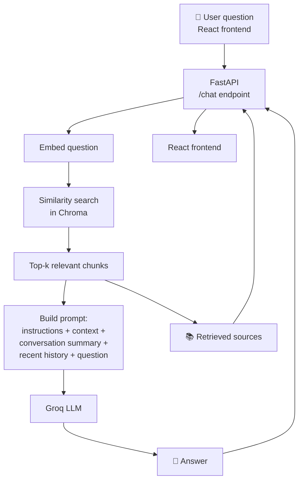

# ✈️ CloudWay RAG — Airline Knowledge Assistant

A Retrieval-Augmented Generation (RAG) chatbot that answers questions about **CloudWay 24**, a fictional airline, using a knowledge base of 40+ PDF documents. Answers are grounded in the retrieved documents, and the sources used are shown next to every response.

---

## 📌 Features

- **Grounded answers**: responses are generated from retrieved airline documents rather than the LLM's memory alone
- **40+ PDF knowledge base**: flights, baggage, policies, passenger assistance and more
- **Semantic search**: Hugging Face `all-MiniLM-L6-v2` embeddings with a Chroma vector database
- **Fast inference**: Groq-hosted LLM
- **Conversation memory**: older messages are summarised automatically so follow-up questions keep their context
- **React frontend**: conversational WhatsApp-style interface for interacting with the RAG assistant
- **FastAPI backend**: REST API connects the React frontend with the RAG pipeline
- **Transparent UI**: retrieved sources are displayed along with every response

---

## 🎬 Demo

<p align="center">
  &nbsp;&nbsp;&nbsp;
  &nbsp;&nbsp;&nbsp;
  
</p>

<p align="center">
  &nbsp;&nbsp;&nbsp;
  &nbsp;&nbsp;&nbsp;
  
</p>

---

## 🧠 How the RAG Pipeline Works

### Phase 1: Ingestion (offline)



1. **Load**: PDFs are read from `knowledge_base/`.
2. **Chunk**: documents are split into smaller overlapping pieces for precise retrieval.
3. **Embed**: each chunk is converted into a vector with `all-MiniLM-L6-v2`.
4. **Store**: vectors and metadata (such as `source`) are saved in Chroma.

### Phase 2: Question answering (online)



1. The user enters a question in the React frontend.
2. The question is sent to the FastAPI `/chat` endpoint.
3. The question is embedded with the same model used during ingestion.
4. Chroma returns the most semantically similar chunks.
5. A prompt is built from the retrieved context, the conversation summary, recent chat history and the question.
6. The Groq LLM generates the answer.
7. FastAPI returns the answer and source information to the React frontend.
8. The React UI displays the response and retrieved sources.

### Phase 3: Conversation memory

- When the chat grows beyond **10 messages**, older messages are condensed into a running summary.
- Only the **last 4 messages** are kept verbatim.
- The summary is passed into every later query, which keeps the prompt short while preserving context.

---

## 🛠️ Tech Stack

| Layer             | Technology                      |
| ----------------- | ------------------------------- |
| Frontend          | React + Vite                    |
| Backend           | FastAPI                         |
| API Communication | Axios                           |
| Orchestration     | LangChain                       |
| Embeddings        | Hugging Face `all-MiniLM-L6-v2` |
| Vector database   | Chroma                          |
| LLM               | Groq (`openai/gpt-oss-120b`)    |
| Language          | Python 3.10+                    |
| Styling           | Tailwind CSS                    |

---

## 📁 Project Structure

```text
CloudWay-RAG/
├── api/
│   └── main.py             # FastAPI application and /chat endpoint
│
├── frontend/
│   ├── src/
│   │   ├── components/     # React UI components
│   │   ├── App.jsx         # Main chat interface
│   │   └── api.js          # API communication
│   ├── package.json
│   └── vite.config.js
│
├── implementation/
│   ├── ingest.py           # Loads PDFs, chunks, embeds, builds vector DB
│   └── answer.py           # Retrieval, prompt building, LLM call, summarisation
│
├── evaluation/
│   ├── eval.py             # Retrieval evaluation
│   └── test.py             # Evaluation tests
│
├── knowledge_base/         # CloudWay 24 PDF documents
├── vector_db/              # Persisted Chroma database
├── requirements.txt
├── evaluator.py
└── README.md
```

---

## 🚀 Getting Started

### 1. Clone the repository

```bash
git clone https://github.com/Nethra910/CloudWay-RAG.git
cd CloudWay-RAG
```

### 2. Create a Python virtual environment

```bash
python -m venv venv
source venv/bin/activate        # macOS / Linux
venv\Scripts\activate           # Windows
```

### 3. Install backend dependencies

```bash
pip install -r requirements.txt
```

### 4. Install frontend dependencies

```bash
cd frontend
npm install
```

### 5. Configure environment variables

Create a `.env` file in the project root:

```env
GROQ_API_KEY=your_groq_api_key_here
RETRIEVAL_K=5
CHUNK_SIZE=500
CHUNK_OVERLAP=200
```

Get a free key from the [Groq Console](https://console.groq.com/).

### 6. Build the vector database

From the project root:

```bash
python implementation/ingest.py
```

### 7. Start the FastAPI backend

From the project root:

```bash
uvicorn api.main:app --reload
```

The API will run at:

```text
http://localhost:8000
```

### 8. Start the React frontend

Open another terminal:

```bash
cd frontend
npm run dev
```

The React application will run at:

```text
http://localhost:5173
```

---

## 💬 Example Questions

- _What is the baggage allowance for economy passengers?_
- _What is CloudWay's policy for cancelled or delayed flights?_
- _What assistance is available for passengers with reduced mobility?_
- _Can I travel with a pet?_

---

## ⚙️ Configuration

| Setting                  | Value                              |
| ------------------------ | ---------------------------------- |
| Embedding model          | `all-MiniLM-L6-v2`                 |
| Chunk size / overlap     | `<CHUNK_SIZE>` / `<CHUNK_OVERLAP>` |
| Retrieved chunks (top-k) | `<K>`                              |
| LLM                      | `openai/gpt-oss-120b` on Groq      |
| Summarise after          | 10 messages (keeps the last 4)     |

---

## 📊 Evaluation

The project includes retrieval evaluation to measure how effectively the system finds relevant documents.

The evaluation includes metrics such as:

- **Mean Reciprocal Rank (MRR)**
- **nDCG**
- **Keyword Coverage**
- **Keyword Matching**

Run the evaluation with:

```bash
python -m evaluation.eval
```

---

## 🔮 Future Improvements

- Hybrid search (keyword + semantic) and reranking
- Query rewriting for follow-up questions
- Source citations inside the answer text
- Evaluation with RAGAS or a larger test question set
- Docker-based deployment
- Improved retrieval and response optimization

---

## 📝 Notes

- CloudWay 24 is a fictional airline created for learning and demonstration.
- Answers are limited to what the knowledge base contains.
- The React frontend communicates with the RAG system through the FastAPI backend.

---

## 🤝 Contributing

Contributions are welcome. Fork the repo, create a feature branch and open a pull request.

## 👤 Author

**Nethra** — [GitHub](https://github.com/Nethra910)
